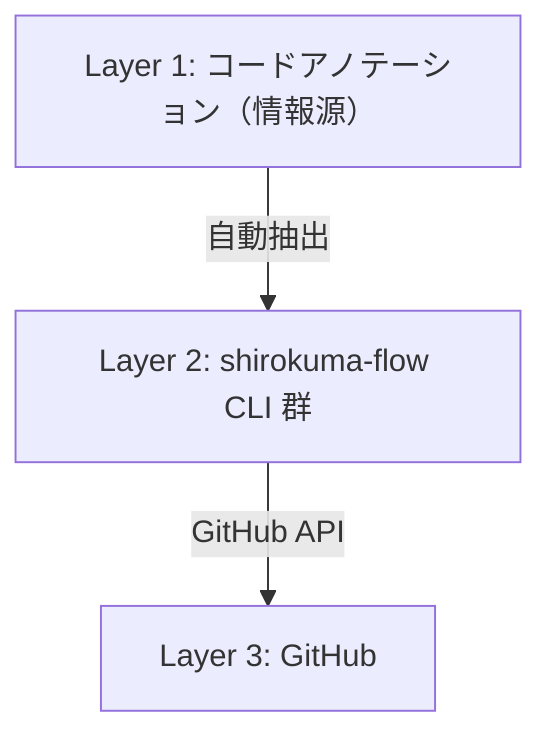

# shirokuma-flow のアーキテクチャ

shirokuma-flow が AI 駆動の開発ワークフローをどのように設計し、なぜその方式を選んだかを説明する。

## 背景

AI（Claude Code 等）と協働する開発ワークフローでは、以下の課題がある:

- **コンテキストウィンドウの制約**: AI が GitHub の情報を取得するのに `gh` CLI を複数回呼ぶと、それだけでコンテキストを消費する
- **構造的知識の欠如**: AI はコードベースの全体像を把握しにくく、毎回探索が必要になる
- **ワークフローの一貫性**: 計画→実装→レビュー→リリースの各段階で規約を維持するのが困難

shirokuma-flow はこれらの課題を、3層のアーキテクチャで解決する。

## 3層アーキテクチャ

### Layer 1: コードアノテーション

コードに埋め込まれた JSDoc タグが、AI が直接読み取る一次情報源となる。

| アノテーション | 用途 | 例 |
|--------------|------|-----|
| `@testdoc` | テストケースの日本語説明 | テストケース一覧に反映 |
| `@screen` | 画面コンポーネントの定義 | 機能マップ・スクリーンショットに反映 |
| `@component` | UIコンポーネントの定義 | 機能マップに反映 |
| `@serverAction` | Server Action の定義 | 機能マップ・API ドキュメントに反映 |
| `@table` | データベーステーブルの定義 | 機能マップに反映 |

コードが唯一の真実（Single Source of Truth）であり、ドキュメントはコードから自動生成される。

### Layer 2: shirokuma-flow CLI 群

CLI は責務ごとに複数のバイナリに分かれている:

- **`shirokuma-flow`**: GitHub Issues / PR / Discussions / Projects 管理、init・update・hooks
- **`shirokuma-portal`**: ドキュメント自動生成（typedoc, schema, deps, portal, ...）
- **`shirokuma-lint`**: コード・ドキュメント・テストの構造 lint
- **`shirokuma-md`**: LLM 最適化 Markdown 結合・lint
- **`shirokuma-codemap`**: コードマップ抽出
- **`shirokuma-context`**: 外部ドキュメントのローカル取得

これらが 2 つの役割を担う:

**ワークフロー管理**: GitHub Issues/Projects/Discussions と統合し、計画→実装→レビューの開発サイクルを 1 コマンドで操作する（`shirokuma-flow`）。

**ドキュメント自動生成**: コードアノテーションから API ドキュメント、テストケース一覧、ER 図、機能マップ等を自動生成する（`shirokuma-portal`）。

### Layer 3: GitHub

計画・意思決定・知見を GitHub に永続化する:

| GitHub 機能 | 用途 |
|-------------|------|
| Issues | タスク管理（Projects V2 フィールド統合） |
| Projects V2 | ステータス・優先度・サイズの可視化 |
| Discussions | ADR、Knowledge、Research |

## 設計判断

### 1コマンド = 必要な情報をすべて返す

通常の `gh` CLI では、Issue 一覧と Projects フィールドの取得に複数コマンドの実行が必要になる。shirokuma-flow では内部で GraphQL を組み立て、1 コマンドで完結させる。

例: `issue list` は Issues の一覧に加えて Status, Priority, Size も返す。`dashboard` は アクティブ Issue + オープン PR + git 状態を 1 回で返す。

これにより AI のコンテキストウィンドウ消費を最小化し、人間にとっても操作が簡潔になる。

### 状態遷移を 1 コマンドに集約（Checkpoint）

`begin` / `submit` / `block` / `resume` といった checkpoint コマンドは、`status transition` + `issue assign` + `issue comment` をまとめて 1 操作にする。`gh issue edit`、`gh project item-edit`、`gh issue comment` のような分割呼び出しを 1 ステップに置き換え、フェーズ移行を確実にする。

### 構造の検証は機械的に、内容の品質は AI に委ねる

shirokuma-lint はドキュメントの構造（必須セクションの存在、リンク整合性等）を機械的にチェックする。文章品質や内容の妥当性の判断は AI に委ねる設計。

この分離により、lint は高速かつ誤検知なしに実行でき、AI は内容の執筆に集中できる。

### スキル・ルールによるワークフローの標準化

Claude Code のスキル（作業パターン）とルール（規約）をプラグインとして配布することで、チーム内でワークフローを標準化する。

- **スキル**: `prepare-flow`（計画）→ `design-flow`（設計、必要な場合）→ `implement-flow`（実装→コミット→PR）の 3 フェーズに加え、独立した `requirements-flow`（要件定義）を持つ 4 フェーズライフサイクル
- **ルール**: `branch-workflow`, `git-commit-style`, `project-items` 等がブランチ命名・コミット形式・ステータス管理の規約を AI に伝達
- **フック**: `shirokuma-hooks` が破壊的コマンド（force push 等）をツールレベルでブロック

## 関連ドキュメント

- [Getting Started](../getting-started.md) — インストールと初期セットアップ
- [GitHub 連携の仕組み](github-integration.md) — GitHub 連携の設計詳細
- [設定ファイルリファレンス](../config.md) — 全設定項目
- [プラグイン管理](../plugins.md) — スキル・ルール・フックの管理方法
