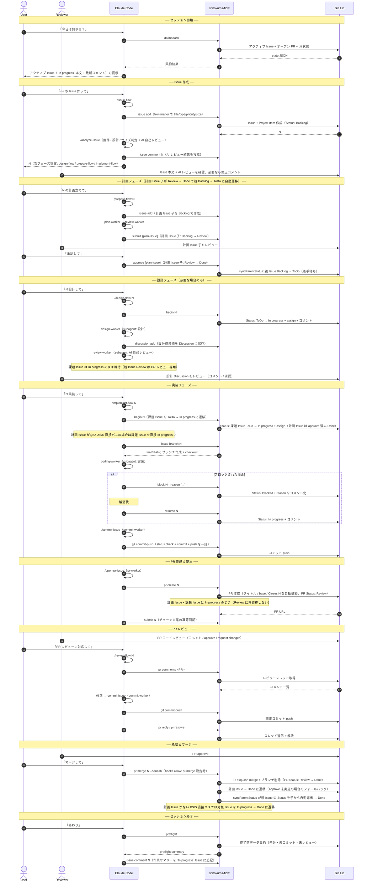
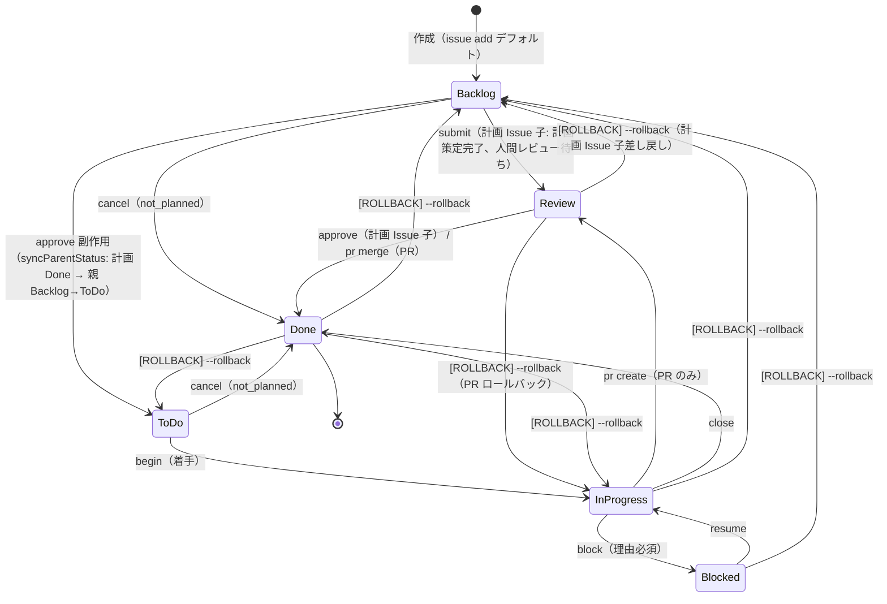
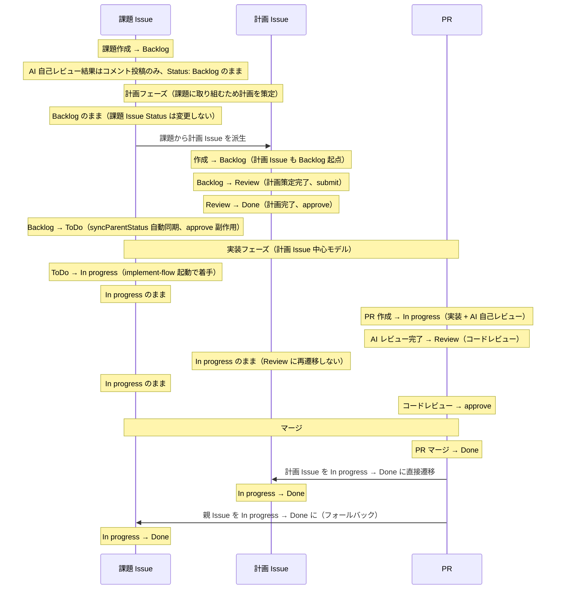
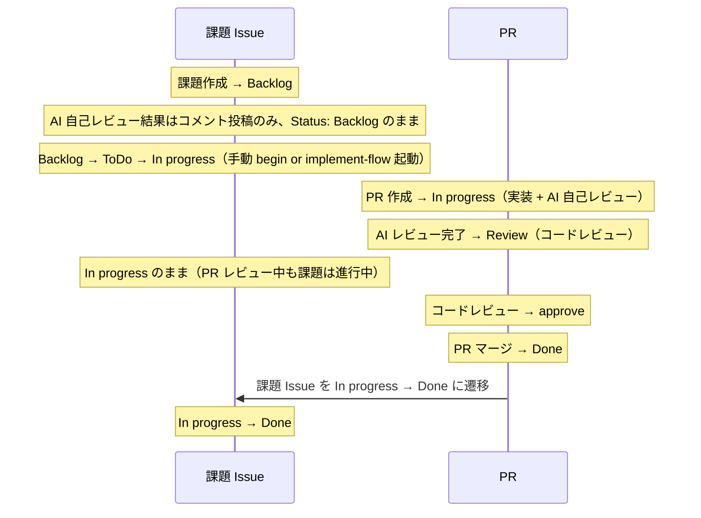
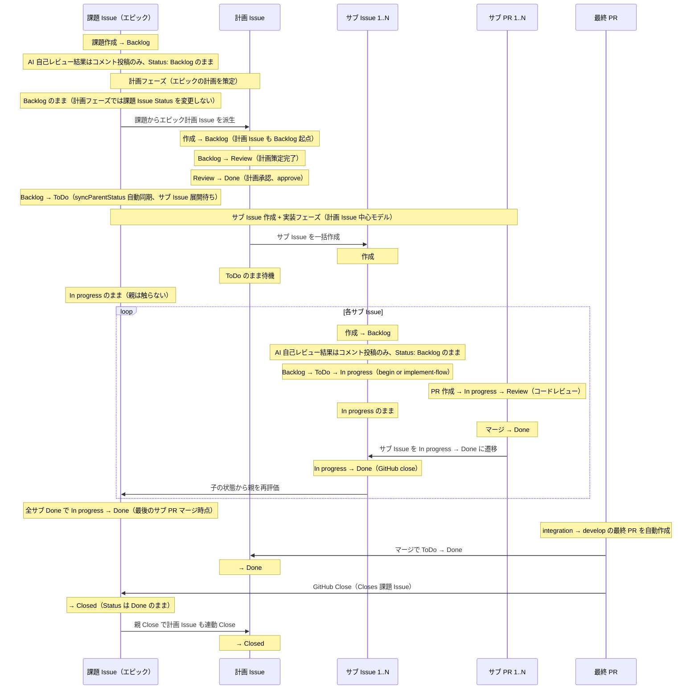
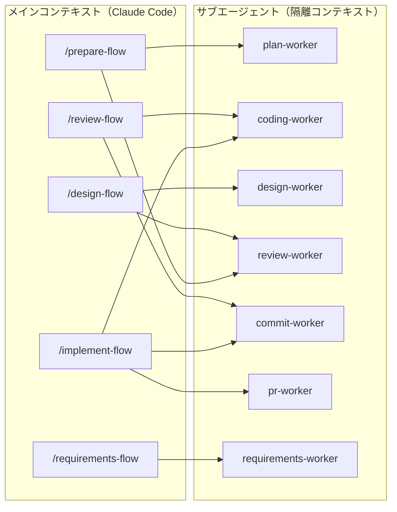

# ライフサイクル全体像

Issue 作成からマージまでの 4 フェーズライフサイクルを、シーケンス図 + 各ステップで呼び出されるスキル / CLI コマンドの対応表でまとめる。

## 用語: フェーズ vs Status

このページでは 2 つの軸を区別する。

| 軸 | 値 | 表現対象 |
|---|---|---|
| **フェーズ** | Designing / Preparing / Working / Requirements | スキル（オーケストレーター）の概念区分 |
| **Status** | Backlog / ToDo / In progress / Blocked / Review / Done | GitHub Projects V2 の Status フィールドの実値（6 値） |

設計フェーズ・計画フェーズ・実装フェーズはすべて GitHub 上では同じ Status（主に `In progress`）で表される。フェーズ進行は **どのスキル（オーケストレーター）が動いているか** で判別する。`Backlog` は未調査・未トリアージ用の Status（新規 Issue 作成時のデフォルト）。

## 登場人物

| アクター | 役割 |
|---|---|
| **User** | 自然言語で Claude Code に指示を出す人間 |
| **Reviewer** | Issue / 計画 / 設計 / PR を GitHub 上でレビューする人間 |
| **Claude Code** | スキル（`/xxx-flow` 等）を選択し、CLI を呼び出すエージェント |
| **shirokuma-flow CLI** | GitHub API を叩く実コマンド（`begin`, `submit`, `issue`, `pr` 等）。**`git` / `gh` を直接呼ばずすべて CLI 経由で完結する設計** |
| **GitHub** | Issues / Projects V2 / Pull Requests / Discussions の永続化先 |

> **User と Reviewer は同一人物のことが多い**。個人開発・小チームでは指示を出す人間とレビューする人間が同じであり、図中で別アクターとして描いているのは「指示モード」と「レビューモード」のコンテキスト切り替えポイントを明示するため。チームで運用する場合は別人になる（Reviewer は別メンバー）。
>
> **AI 自己レビュー vs 人間レビュー**: `review-worker`（subagent）は計画 / 設計 / コードに対する **AI 自己レビュー**を実施する。**人間レビュアー**は各成果物が `Review` Status に遷移した時点で GitHub UI 上から確認・承認する。

## 全体シーケンス

## フェーズ別コマンドマップ

各フェーズで使われるスキル・CLI・GitHub への影響を一覧化する。

### 1. セッション管理

| 場面 | スキル | CLI | GitHub への影響 |
|---|---|---|---|
| 開始 | `/starting-session [#N]` | `rules inject` | ルール注入のみ（GitHub 影響なし） |
| 状態確認 | `/show-dashboard` | `dashboard` | 読み取りのみ |
| 終了前データ取得 | （手動） | `preflight` | 読み取りのみ |
| 整合性チェック | （手動） | `integrity [--fix]` | Project Status の修正 + 計画 Issue / 親 Issue の不整合検出 |
| 作業サマリー記録 | `/implement-flow` チェーン完了時 | `issue comment` | `In progress` Issue にコメント投稿（Issue 一元化） |

### 2. Issue 作成

| 場面 | スキル | CLI | GitHub への影響 | Reviewer 関与 |
|---|---|---|---|---|
| 自然言語からの Issue 化 | `/issue-flow` | `issue add` | Issue + Project Item 作成 | — |
| 要件 / 設計 / サイズ判定 | `/analyze-issue` | （内部） | Project Status 設定 | — |
| Discussion からの変換 | `/issue-flow` | `discussion show` + `issue add` | 同上 | — |
| **Issue 内容の確認** | — | — | — | ✅ GitHub UI で本文確認・修正コメント |

### 3. 設計フェーズ（条件付き）

| 場面 | スキル | CLI | GitHub への影響 | Reviewer 関与 |
|---|---|---|---|---|
| 設計開始 | `/design-flow #N` | `begin N` | Status: ToDo → In progress + assign | — |
| Next.js 設計 | `designing-nextjs`（委任） | `discussion add` | Discussion 作成 | — |
| UI 設計 | `designing-shadcn-ui`（委任） | `discussion add` | 同上 | — |
| DB 設計 | `designing-drizzle`（委任） | `discussion add` | 同上 | — |
| AI 自己レビュー | `review-worker`（subagent） | `discussion comment` | Discussion へのコメント | — |
| 設計提出 | `/design-flow` 末尾 | `discussion add`（設計 Discussion） | 課題 Issue Status は変更しない（親 Issue Review は PR レビュー専用） | — |
| **設計内容のレビュー** | — | — | — | ✅ Discussion をレビュー・承認 / 差し戻し |

### 4. 計画フェーズ

| 場面 | スキル | CLI | GitHub への影響 | Reviewer 関与 |
|---|---|---|---|---|
| 計画開始 | `/prepare-flow #N` | （課題 Issue Status 変更なし）、計画 Issue 子を `issue add` で Backlog として作成 | 課題 Issue は Backlog のまま（計画フェーズでは課題 Issue Status を変更しない） | — |
| Issue 取得 | （内部） | `issue pull N` | 読み取りのみ | — |
| 計画策定 | `plan-worker`（subagent） | `issue update N <body-file>` | Issue 本文更新 | — |
| AI 自己レビュー | `review-worker`（subagent） | `issue comment` | コメント | — |
| 計画提出 | `/prepare-flow` 末尾 | `submit N` | 計画 Issue 子のみ Backlog → Review、親 Issue Status は変更しない | — |
| **計画内容のレビュー** | — | — | — | ✅ Issue 本文をレビュー・承認 / 差し戻し |
| 計画承認 | （自然言語「実装して」） | `approve N` | Review → Done（計画完了）。親 Issue は syncParentStatus で Backlog → ToDo 自動同期 | — |
| 計画差し戻し | （自然言語「再計画」） | `reject N --reason "..." --rollback` | (Issue) Status: Review → Backlog / (PR) Status: Review → In progress + reason をコメント化 | — |
| 計画破棄 | （自然言語「やめる」） | `cancel N` | Status: → Done(not_planned) + Close + 親から unparent | — |

### 5. 実装フェーズ

| 場面 | スキル | CLI | GitHub への影響 | Reviewer 関与 |
|---|---|---|---|---|
| 着手（計画 Issue あり） | `/implement-flow #N` | `begin N`（課題 Issue） | Status: 課題 Issue ToDo → In progress + assign（計画 Issue は approve 済み Done） | — |
| 着手（XS/S 直接パス、計画 Issue なし） | `/implement-flow #N` | `begin N` | Status: 課題 Issue ToDo → In progress + assign（Backlog 起点の場合は `implement-flow` が事前に `approve` 経由で ToDo へ遷移済みであることが前提。`begin` 単体は `Backlog → In progress` の直接遷移をサポートしない） | — |
| ブランチ作成 | （内部） | `issue branch N` | feature ブランチ作成 + checkout | — |
| 実装 | `coding-worker`（subagent） | （ファイル編集） | なし | — |
| ブロック | （手動 or 自動） | `block N --reason "..."` | Status: Blocked + コメント | — |
| 再開 | （手動 or 自動） | `resume N` | Status: In progress + コメント | — |
| コミット & push | `/commit-issue`（commit-worker） | `git commit-push` | コミット push | — |

> **`git` を直接呼ばない**: ブランチ作成は `issue branch`、コミットと push は `git commit-push`（status check + add + commit + push を 1 コマンドに集約）。

### 6. PR & レビュー

| 場面 | スキル | CLI | GitHub への影響 | Reviewer 関与 |
|---|---|---|---|---|
| PR 作成 | `/open-pr-issue`（pr-worker） | `pr create N` | PR 作成（タイトル / base / Closes #N 自動構築）、PR 自身を In progress → Review に遷移 | — |
| レビュー提出 | `/implement-flow` 末尾 | `submit N` | Status: → Review + 作業サマリーコメント（`pr create` 自動遷移後の冪等同期） | — |
| **PR コードレビュー** | — | — | — | ✅ GitHub UI でコメント / approve / request changes |
| レビュー対応 | `/review-flow #N` | `pr comments` → `pr reply` → `pr resolve` | スレッド返信 / 解決 | — |
| 修正コミット | `commit-worker` | `git commit-push` | コミット push | — |
| 承認 | — | — | — | ✅ PR approve |
| マージ | （自然言語「マージして」） | `pr merge N --squash` | PR squash merge + ブランチ削除 + 計画 Issue を Done（計画なしの場合は対象 Issue を Done）+ `syncParentStatus` で親を自動導出 | — |
| クローズ | （自然言語） | （自動） | 親 Issue は `syncParentStatus` で自動 Done（明示 `approve` 不要） | — |
| 差し戻し（実装やり直し） | （Reviewer の request changes 後） | `reject N --reason "..." --rollback` | Issue: Review → Backlog / PR: Review → In progress（`--rollback` 必須）+ reason をコメント化 | — |

> **`gh` を直接呼ばない**: PR 作成は `pr create`、マージは `pr merge`。`pr merge` は安全フックで人手承認必須にできる（`.shirokuma/config.yaml` の `hooks.allow: [pr-merge]` 設定で Claude も実行可能）。

### 7. 要件定義（独立フェーズ）

`requirements-flow` は Issue ステータスを操作しない独立フェーズ。要件定義 → Discussion での仕様策定を完結させる。

| 場面 | スキル | CLI | GitHub への影響 |
|---|---|---|---|
| 要件定義開始 | `/requirements-flow` | （なし） | なし |
| 仕様策定 | `requirements-worker`（subagent） | `discussion add`（Knowledge / Research） | Discussion 作成 |

## ステータス遷移と checkpoint コマンド

GitHub Projects V2 の Status は 6 値（`Backlog` / `ToDo` / `In progress` / `Blocked` / `Review` / `Done`）。遷移は Issue / PR × Forward / Rollback の **4 系統テーブル**で管理され、**checkpoint コマンド**で 1 操作に集約される（`status transition` + `issue assign` + `issue comment` を個別に呼ぶ必要はない）。

> **起点ルール**: 課題 Issue / 計画 Issue は作成直後は **Backlog**（未調査・未トリアージ）から始まる。PR は `In progress` から `pr create` で `Review` に遷移する。
>
> **承認ルール**: 計画 Issue (子) の `approve` は `Review → Done`（計画完了）。`syncParentStatus` が自動的に親 Issue を `Backlog → ToDo`（着手準備完了）に同期する。
>
> **PR の特例**: PR は `Backlog` / `ToDo` を経由しない。`pr create` で `In progress → Review`、`pr merge` で `Review → Done`。コードレビュー差し戻しは `--rollback` フラグで `Review → In progress`。
>
> **ロールバック遷移**: `--rollback` フラグ必須。警告付きで履歴に `[ROLLBACK]` マーク。フラグなしでロールバック先を指定するとエラーになる。
>
> **Backlog**: 新規 Issue 作成時のデフォルト Status。未調査・未トリアージの状態。`ToDo` は計画承認済みの着手準備完了を意味する（Backlog と ToDo を明確に区別）。

### Issue / 計画 / PR の連動シーケンス

state machine が単一エンティティの遷移なのに対し、実運用では **課題 Issue・計画 Issue・PR の 3 エンティティ**が互いに連動して動く。誰が（User/CLI/GitHub）ではなく「どのエンティティが、どの操作で動くか」を時系列で示す。

#### 図の補足注釈

- **課題作成直後は Status: Backlog**: `issue add` で作成された課題 Issue は Status: Backlog で起動する。未調査・未トリアージの状態を表す。
- **AI 自己レビュー結果はコメント投稿のみ**: `issue-flow` 末で `analyze-issue` の結果が Issue コメントに投稿されるが、Status は Backlog のまま変化しない（親 Issue の Review は PR レビュー専用）。
- **approve コマンドは計画 Issue (子) の Review → Done**: `approve` コマンドは計画 Issue (子) の Review → Done 遷移を行う（計画完了）。親 Issue は `syncParentStatus` で Backlog → ToDo に自動同期される。課題 Issue 自体は approve の対象外。
- **計画フェーズの課題 Issue**: `prepare-flow` は課題 Issue の Status を変更しない（Backlog のまま維持）。計画策定の実作業は計画 Issue 上で進む（計画 Issue は Backlog → Review → Done を経由）。課題 Issue は計画 Issue (子) の `approve` 後に `syncParentStatus` で Backlog → ToDo に自動同期される。
- **計画 Issue 作成**: `prepare-flow` が課題 Issue の子として生成する（親子関係を設定）。
- **計画承認 → 実装着手**: 計画 Issue は Backlog → Review → Done（計画承認）。approve 副作用で `syncParentStatus` が親 Issue を Backlog → ToDo に同期し、`implement-flow` 起動で課題 Issue が ToDo → In progress になる（計画 Issue は Close）。
- **実装フェーズの課題 Issue は In progress のまま**: 実装フェーズで PR が動く間、課題 Issue は In progress のまま触らない。PR マージ時に In progress → Done に遷移する。
- **PR が Status: Review を担う**: 実装フェーズでは PR 自身が Status: Review でコードレビューを表現する。計画 Issue / 課題 Issue は Review に再遷移せず In progress のまま。Review の意味は「計画 Issue 子: 計画レビュー（Backlog → Review、親 Issue は Review に上がらない）/ PR: コードレビュー」と整理される。
- **PR は ToDo を経由しない**: PR の approve はマージ承認を意味し、`pr merge` で Review → Done に直接遷移する。Issue は「承認 → 着手 → 完了」の 2 段階だが、PR は「approve = マージ = 完了」の 1 段階。
- **PR 作成・マージでの Issue 自動遷移**: `pr create` で PR 自身を Status: Review に。`pr merge` で計画 Issue を In progress → Done、計画 Issue がない場合は課題 Issue を In progress → Done に遷移させる。
- **子の状態から親を導出**: `syncParentStatus` が計画 Issue を集計から除外した上で、残りの子 Issue の Status から親の Status を自動導出する。親は手動操作不要で常に最新の状態に保たれる。
- **計画 Issue 単独サブのフォールバック**: 課題 Issue の子が「計画 Issue 1 つだけ」の場合、`syncParentStatus` の集計除外で残りが空集合になり親が Done に遷移しない。`syncParentStatus` 拡張により計画 Issue Done → 親 Backlog → ToDo に同期されるため、この経路でも親の Status が正しく更新される。`pr merge` のフォールバックロジックが親 Issue を直接 Done に遷移する（通常パターンの典型ケース）。
- **親 Close 連動**: 課題 Issue が Close されると計画 Issue（および他の OPEN な子 Issue）も cascade で Close される。

#### 計画 Issue がない場合（XS/S 直接実装パス）

サイズ XS/S かつ要件明確な Issue は計画フェーズをスキップし、課題 Issue を直接動かす。

> 計画 Issue がない場合、`pr create` / `pr merge` は課題 Issue を直接遷移させる（フォールバック）。これがバグ修正やリファクタなど短期完結タスク向けの軽量パス。

#### エピック計画 + サブ Issue 分割

大きな課題は計画 Issue に「サブ Issue 構成」を含めるエピック形式にし、複数の実作業サブ Issue に分割する。各サブ Issue は専用 PR を持ち、共通の integration ブランチに集約された後、最終 PR で課題 Issue 全体が Done になる。

#### 図の補足注釈

- **エピック計画**: 計画 Issue 本文に「サブ Issue 構成」セクションを含める。`prepare-flow` の Phase 4a または `implement-flow` のエピックエントリーポイントが、このセクションを解析してサブ Issue を一括作成する。
- **計画フェーズの課題 Issue（エピック）**: 通常パターンと同じく `prepare-flow` は課題 Issue（エピック）の Status を変更しない（Backlog のまま）。計画 Issue は Backlog → Review → Done（approve）で完了し、syncParentStatus が親 Issue を Backlog → ToDo に同期する。サブ Issue の一括作成は計画承認後（計画 Issue が Review → Done に遷移したタイミング）にまとめて行う。
- **integration ブランチ**: エピックでは `develop` から `epic/N-slug` などの integration ブランチを作成し、各サブ PR はこれをベースにマージする。最終的に integration → `develop` の単一 PR でまとめて取り込む。
- **サブ Issue の PR**: 各サブ Issue の PR は base が integration ブランチであり、`pr merge` 時にリンク Issue を REST API で明示的に close する（GitHub の自動 close は `develop` ベースでないと動かないため）。
- **親 Status: Done のタイミング**: 課題 Issue の Status が Done になるのは「最後のサブ PR マージ時点」（Review → Done）。各サブ PR マージごとに `syncParentStatus` が走り、計画 Issue を集計除外した残りのサブから親を再評価する。全サブが Done になった時点で親も Done に自動遷移する。最終 PR マージは Status 遷移ではなく **GitHub Close** と **計画 Issue Done** を担う。
- **最終 PR の自動作成**: 全サブ Issue 完了 + 全計画完了を `pr merge` が検知すると、integration → `develop` の PR を自動作成して Review に追加する。
- **計画 Issue Done のタイミング**: エピック計画 Issue は実作業をしないため ToDo のまま待機する。最終 PR マージ時に `pr merge` の `fetchPlanIssueForParent` ロジックが計画 Issue を取得し、ToDo → Done に遷移する。
- **親 Close 連動**: 最終 PR の `Closes #課題` で課題 Issue が GitHub Close され、`syncChildCloseOnParentClose` が OPEN な子を cascade で close する。対象は計画 Issue + 実作業サブ Issue（設計 Issue は別ライフサイクルで管理されるため除外）。`pr merge` / `issue close` / `issue cancel` のいずれの経路でも同じフィルタが適用される。

### Checkpoint 一覧

ライフサイクルの遷移点はすべて **top-level checkpoint コマンド**に集約される。**日常運用ではこれらの checkpoint を優先**し、`status transition` 等の primitive は直接呼ばない。

| Checkpoint | 効果 | 入力 | 内部処理（参考） |
|---|---|---|---|
| `begin N` | → In progress + assign | Issue 番号 | `status transition --to "In progress"` + `issue assign @me` + `issue comment` |
| `submit N [--comment FILE]` | → Review | Issue 番号、任意のコメント | `issue comment`（任意） + `status transition --to Review`（`--via` で 2 段階遷移可） |
| `block N --reason <text>` | → Blocked | Issue 番号、ブロック理由（必須） | `status transition --to Blocked` + `issue comment`（reason を自動記録） |
| `resume N [--comment FILE]` | Blocked → In progress | Issue 番号、任意のコメント | `issue comment`（任意） + `status transition --to "In progress"` |
| `approve N` | Review → Done（計画 Issue 子の計画完了。syncParentStatus が親 Backlog → ToDo 自動同期。Issue Type は計画 Issue のみ対象、課題 Issue は approve 不要） | Issue 番号 | `status approve` の top-level エイリアス。計画 Issue (子) を Done に遷移し Close する |
| `reject N --reason <text> --rollback` | (Issue) Review → Backlog / (PR) Review → In progress（`--rollback` 必須）| Issue 番号、差し戻し理由（必須） | `issue comment`（reason を記録） + `status transition --rollback` |
| `cancel N [--body-file FILE]` | → Done (state_reason: not_planned) | Issue 番号、任意のコメント | `issue cancel` の top-level エイリアス。Close + Status 設定 + 親からの自動 unparent |
| `pr merge N --squash` | PR squash merge + ブランチ削除 | PR 番号 | `pr merge` sub-command。Issue を `Closes #N` 経由で自動 Close |

> Top-level に並ぶ 7 個の checkpoint（`begin` / `submit` / `block` / `resume` / `approve` / `reject` / `cancel`）が Issue ライフサイクル全体をカバーする。`pr merge` のみ PR 操作なので `pr` sub-command 配下。

### 設計原則

1. **Status 遷移を伴う操作は checkpoint 経由で 1 コマンド化**: `status transition` + `issue assign` + `issue comment` の組み合わせを直接呼ばず、意図を表現する checkpoint を使う
2. **理由（reason）が semantically 必須な遷移は `--reason` 必須**: `block` / `reject` は reason が必須。reason は自動的に Issue コメントとして記録される
3. **コメント投稿はステータス遷移より前**: ステータス遷移が失敗してもコメントは記録される（再実行時の重複防止）
4. **冪等性**: 同じ checkpoint を再実行しても安全（既に目的 Status の場合は no-op またはエラーで停止）

## オーケストレーターと Worker の関係

スキルは「オーケストレーター」と「ワーカー」の 2 層構造。オーケストレーターは Skill ツールでメインコンテキストから呼び出され、重い作業はサブエージェント（Agent ツール）の worker に委任することでメインコンテキストを保護する。

worker は CLI と直接やり取りし、結果のみを親オーケストレーターに返す。

## 関連ドキュメント

- [ワークフローガイド](README.md) — フェーズ別の詳細
- [Issue 管理](issue-management.md) — Issue 作成・管理の指示方法
- [実装ワークフロー](implementation.md) — 4 フェーズの詳細
- [レビューと PR](review-and-pr.md) — PR 作成・レビュー対応
- [セッション管理](session-management.md) — checkpoint / dashboard / preflight / integrity
- [GitHub 連携の仕組み](../concepts/github-integration.md) — なぜこの設計か
- [CLI クイックリファレンス](../reference/cli-quick-reference.md) — 全コマンド構文
